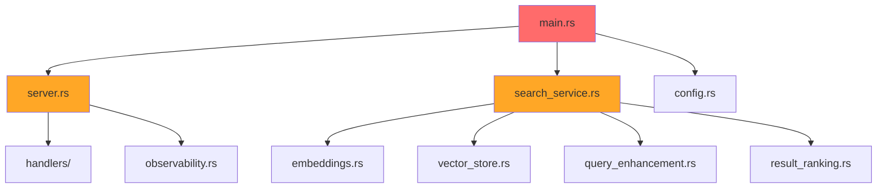

# Phase 4C: Enterprise Architecture & SOLID Principles

**Date:** August 21, 2025  
**Context:** Architectural refactoring for enterprise scalability and maintainability  
**Status:** Strategic planning and implementation roadmap  

## 🎯 Overview

Phase 4C addresses the fundamental architectural concerns about the current monolithic structure. This phase implements SOLID principles, enterprise patterns, and creates a more maintainable, testable, and scalable codebase.

## 🏗️ Current Architecture Analysis

### Monolithic Structure Issues

#### Single Binary Concerns
```rust
// Current: services/doc-indexer/src/main.rs
// Everything in one binary:
// - HTTP server
// - Vector operations
// - File processing
// - Configuration management
// - Observability
// - Search logic
```

#### Identified Problems
- **Single Responsibility Violation**: One service handles too many concerns
- **Tight Coupling**: Direct dependencies between unrelated modules
- **Testing Complexity**: Difficult to test individual components in isolation
- **Deployment Rigidity**: Cannot scale individual components independently
- **Code Navigation**: Large files with mixed responsibilities

### Dependency Analysis


## 🎯 SOLID Principles Implementation

### Single Responsibility Principle (SRP)

#### Domain Separation
```rust
// Before: services/doc-indexer/src/search_service.rs (400+ lines)
impl SearchService {
    pub async fn search(&self, request: SearchRequest) -> Result<SearchResponse> {
        // Query enhancement
        // Vector operations  
        // Result ranking
        // Observability
        // Response formatting
    }
}

// After: Separated responsibilities
pub struct QueryProcessor {
    enhancer: Arc<QueryEnhancer>,
}

pub struct VectorSearchEngine {
    store: Arc<VectorStore>,
    embedding_service: Arc<EmbeddingService>,
}

pub struct ResultRanker {
    config: RankingConfig,
    metrics: Arc<SearchMetrics>,
}

pub struct SearchOrchestrator {
    query_processor: Arc<QueryProcessor>,
    search_engine: Arc<VectorSearchEngine>, 
    ranker: Arc<ResultRanker>,
    observer: Arc<SearchObserver>,
}
```

#### File Structure Refactoring
```
services/doc-indexer/src/
├── main.rs                    # Application entry point only
├── application/               # Application layer
│   ├── mod.rs
│   ├── search_orchestrator.rs # Coordinates search workflow
│   ├── indexing_orchestrator.rs
│   └── health_service.rs
├── domain/                    # Business logic
│   ├── mod.rs
│   ├── models/               # Domain entities
│   │   ├── search_request.rs
│   │   ├── search_result.rs
│   │   └── document.rs
│   ├── services/             # Domain services
│   │   ├── query_processor.rs
│   │   ├── vector_search_engine.rs
│   │   ├── result_ranker.rs
│   │   └── embedding_service.rs
│   └── repositories/         # Repository traits
│       ├── vector_repository.rs
│       └── document_repository.rs
├── infrastructure/           # External concerns
│   ├── mod.rs
│   ├── vector_store/
│   │   ├── chroma_store.rs
│   │   └── in_memory_store.rs
│   ├── embedding/
│   │   ├── openai_embeddings.rs
│   │   └── local_embeddings.rs
│   ├── persistence/
│   │   └── file_document_store.rs
│   └── observability/
│       ├── prometheus_metrics.rs
│       └── structured_logging.rs
├── presentation/             # HTTP layer
│   ├── mod.rs
│   ├── server.rs
│   ├── handlers/
│   │   ├── search_handler.rs
│   │   ├── metrics_handler.rs
│   │   └── health_handler.rs
│   └── middleware/
│       ├── request_id.rs
│       └── cors.rs
└── configuration/           # Configuration management
    ├── mod.rs
    ├── app_config.rs
    └── environment.rs
```

### Open/Closed Principle (OCP)

#### Extensible Search Pipeline
```rust
// domain/services/search_pipeline.rs
pub trait SearchStep: Send + Sync {
    async fn execute(&self, context: &mut SearchContext) -> Result<()>;
}

pub struct SearchPipeline {
    steps: Vec<Box<dyn SearchStep>>,
}

impl SearchPipeline {
    pub fn builder() -> SearchPipelineBuilder {
        SearchPipelineBuilder::new()
    }

    pub async fn execute(&self, request: SearchRequest) -> Result<SearchResponse> {
        let mut context = SearchContext::new(request);
        
        for step in &self.steps {
            step.execute(&mut context).await?;
        }
        
        Ok(context.into_response())
    }
}

// Concrete implementations
pub struct QueryEnhancementStep {
    enhancer: Arc<QueryEnhancer>,
}

#[async_trait]
impl SearchStep for QueryEnhancementStep {
    async fn execute(&self, context: &mut SearchContext) -> Result<()> {
        let enhanced_query = self.enhancer.enhance(&context.request.query).await?;
        context.set_enhanced_query(enhanced_query);
        Ok(())
    }
}

pub struct VectorSearchStep {
    engine: Arc<VectorSearchEngine>,
}

#[async_trait] 
impl SearchStep for VectorSearchStep {
    async fn execute(&self, context: &mut SearchContext) -> Result<()> {
        let results = self.engine.search(
            &context.enhanced_query(),
            context.request.k
        ).await?;
        context.set_vector_results(results);
        Ok(())
    }
}

// Easy to add new steps without modifying existing code
pub struct SemanticRewriteStep {
    rewriter: Arc<SemanticRewriter>,
}

pub struct UserContextStep {
    personalizer: Arc<SearchPersonalizer>,
}
```

#### Plugin Architecture
```rust
// domain/plugins/mod.rs
pub trait SearchPlugin: Send + Sync {
    fn name(&self) -> &str;
    fn version(&self) -> &str;
    async fn initialize(&mut self, config: PluginConfig) -> Result<()>;
    fn steps(&self) -> Vec<Box<dyn SearchStep>>;
}

pub struct PluginRegistry {
    plugins: HashMap<String, Box<dyn SearchPlugin>>,
}

impl PluginRegistry {
    pub fn register<P: SearchPlugin + 'static>(&mut self, plugin: P) -> Result<()> {
        let name = plugin.name().to_string();
        self.plugins.insert(name, Box::new(plugin));
        Ok(())
    }

    pub fn create_pipeline(&self, config: &PipelineConfig) -> Result<SearchPipeline> {
        let mut builder = SearchPipeline::builder();
        
        for step_config in &config.steps {
            if let Some(plugin) = self.plugins.get(&step_config.plugin_name) {
                for step in plugin.steps() {
                    builder = builder.add_step(step);
                }
            }
        }
        
        Ok(builder.build())
    }
}
```

### Liskov Substitution Principle (LSP)

#### Vector Store Abstraction
```rust
// domain/repositories/vector_repository.rs
#[async_trait]
pub trait VectorRepository: Send + Sync {
    async fn insert(&self, vectors: Vec<VectorDocument>) -> Result<()>;
    async fn search(&self, query_vector: Vec<f32>, k: usize) -> Result<Vec<SimilarityResult>>;
    async fn delete(&self, document_id: &str) -> Result<bool>;
    async fn update(&self, document_id: &str, vector: Vec<f32>) -> Result<bool>;
    async fn health_check(&self) -> Result<HealthStatus>;
}

// Concrete implementations that are fully substitutable
pub struct ChromaVectorRepository {
    client: ChromaClient,
    collection: String,
}

#[async_trait]
impl VectorRepository for ChromaVectorRepository {
    async fn insert(&self, vectors: Vec<VectorDocument>) -> Result<()> {
        // Chroma-specific implementation
        let embeddings: Vec<_> = vectors.iter().map(|v| &v.embedding).collect();
        let metadatas: Vec<_> = vectors.iter().map(|v| &v.metadata).collect();
        let ids: Vec<_> = vectors.iter().map(|v| &v.id).collect();
        
        self.client.collection(&self.collection)
            .add(embeddings, Some(metadatas), Some(ids))
            .await
            .map_err(Into::into)
    }

    async fn search(&self, query_vector: Vec<f32>, k: usize) -> Result<Vec<SimilarityResult>> {
        let results = self.client.collection(&self.collection)
            .query(vec![query_vector], k, None, None, None)
            .await?;
            
        Ok(results.into_similarity_results())
    }

    async fn health_check(&self) -> Result<HealthStatus> {
        match self.client.heartbeat().await {
            Ok(_) => Ok(HealthStatus::Healthy),
            Err(e) => Ok(HealthStatus::Unhealthy(e.to_string())),
        }
    }
}

pub struct InMemoryVectorRepository {
    vectors: RwLock<HashMap<String, VectorDocument>>,
}

#[async_trait]
impl VectorRepository for InMemoryVectorRepository {
    async fn insert(&self, vectors: Vec<VectorDocument>) -> Result<()> {
        let mut store = self.vectors.write().await;
        for vector in vectors {
            store.insert(vector.id.clone(), vector);
        }
        Ok(())
    }

    async fn search(&self, query_vector: Vec<f32>, k: usize) -> Result<Vec<SimilarityResult>> {
        let store = self.vectors.read().await;
        let mut similarities: Vec<_> = store.values()
            .map(|doc| {
                let similarity = cosine_similarity(&query_vector, &doc.embedding);
                SimilarityResult {
                    document_id: doc.id.clone(),
                    similarity,
                    metadata: doc.metadata.clone(),
                }
            })
            .collect();
            
        similarities.sort_by(|a, b| b.similarity.partial_cmp(&a.similarity).unwrap());
        similarities.truncate(k);
        Ok(similarities)
    }

    async fn health_check(&self) -> Result<HealthStatus> {
        // Always healthy for in-memory implementation
        Ok(HealthStatus::Healthy)
    }
}
```

### Interface Segregation Principle (ISP)

#### Focused Interfaces
```rust
// Instead of one large SearchService interface, create focused interfaces

// domain/services/query_processing.rs
#[async_trait]
pub trait QueryEnhancer: Send + Sync {
    async fn enhance(&self, query: &str) -> Result<EnhancedQuery>;
}

#[async_trait]
pub trait QueryValidator: Send + Sync {
    async fn validate(&self, query: &str) -> Result<ValidationResult>;
}

// domain/services/vector_operations.rs
#[async_trait]
pub trait EmbeddingGenerator: Send + Sync {
    async fn generate_embedding(&self, text: &str) -> Result<Vec<f32>>;
    async fn generate_batch_embeddings(&self, texts: Vec<&str>) -> Result<Vec<Vec<f32>>>;
}

#[async_trait]
pub trait SimilarityCalculator: Send + Sync {
    fn calculate_similarity(&self, a: &[f32], b: &[f32]) -> f32;
    fn batch_similarities(&self, query: &[f32], candidates: &[Vec<f32>]) -> Vec<f32>;
}

// domain/services/result_processing.rs
#[async_trait]
pub trait ResultRanker: Send + Sync {
    async fn rank(&self, results: Vec<SearchResult>) -> Result<Vec<RankedResult>>;
}

#[async_trait]
pub trait ResultFormatter: Send + Sync {
    async fn format(&self, results: Vec<RankedResult>, format: ResponseFormat) -> Result<FormattedResponse>;
}

// domain/services/observability.rs
#[async_trait]
pub trait MetricsCollector: Send + Sync {
    fn record_search_request(&self, query: &str, result_count: usize, duration: Duration);
    fn record_embedding_generation(&self, duration: Duration);
    fn record_vector_search(&self, duration: Duration, result_count: usize);
}

#[async_trait]
pub trait HealthChecker: Send + Sync {
    async fn check_health(&self) -> Result<ComponentHealth>;
}
```

### Dependency Inversion Principle (DIP)

#### Dependency Injection Container
```rust
// infrastructure/dependency_injection.rs
pub struct ServiceContainer {
    // Vector operations
    vector_repository: Arc<dyn VectorRepository>,
    embedding_generator: Arc<dyn EmbeddingGenerator>,
    
    // Query processing
    query_enhancer: Arc<dyn QueryEnhancer>,
    query_validator: Arc<dyn QueryValidator>,
    
    // Result processing
    result_ranker: Arc<dyn ResultRanker>,
    result_formatter: Arc<dyn ResultFormatter>,
    
    // Observability
    metrics_collector: Arc<dyn MetricsCollector>,
    health_checker: Arc<dyn HealthChecker>,
    
    // Configuration
    config: Arc<AppConfig>,
}

impl ServiceContainer {
    pub fn new(config: AppConfig) -> Result<Self> {
        let config = Arc::new(config);
        
        // Create concrete implementations based on configuration
        let vector_repository: Arc<dyn VectorRepository> = match config.vector_store.store_type {
            VectorStoreType::Chroma => Arc::new(ChromaVectorRepository::new(&config.vector_store)?),
            VectorStoreType::InMemory => Arc::new(InMemoryVectorRepository::new()),
        };

        let embedding_generator: Arc<dyn EmbeddingGenerator> = match config.embeddings.provider {
            EmbeddingProvider::OpenAI => Arc::new(OpenAIEmbeddingGenerator::new(&config.embeddings)?),
            EmbeddingProvider::Local => Arc::new(LocalEmbeddingGenerator::new(&config.embeddings)?),
        };

        let metrics_collector: Arc<dyn MetricsCollector> = Arc::new(
            PrometheusMetricsCollector::new()
        );

        let query_enhancer: Arc<dyn QueryEnhancer> = Arc::new(
            TechnicalQueryEnhancer::new()
        );

        let result_ranker: Arc<dyn ResultRanker> = Arc::new(
            MultiFactorResultRanker::new(config.ranking.clone())
        );

        Ok(Self {
            vector_repository,
            embedding_generator,
            query_enhancer,
            query_validator: Arc::new(BasicQueryValidator::new()),
            result_ranker,
            result_formatter: Arc::new(JsonResultFormatter::new()),
            metrics_collector,
            health_checker: Arc::new(CompositeHealthChecker::new()),
            config,
        })
    }

    // Getters for dependency injection
    pub fn vector_repository(&self) -> Arc<dyn VectorRepository> {
        self.vector_repository.clone()
    }

    pub fn embedding_generator(&self) -> Arc<dyn EmbeddingGenerator> {
        self.embedding_generator.clone()
    }

    pub fn search_orchestrator(&self) -> SearchOrchestrator {
        SearchOrchestrator::new(
            self.query_enhancer.clone(),
            self.vector_repository.clone(),
            self.embedding_generator.clone(),
            self.result_ranker.clone(),
            self.metrics_collector.clone(),
        )
    }
}
```

#### Application Composition Root
```rust
// main.rs - Clean composition root
#[tokio::main]
async fn main() -> Result<()> {
    // Load configuration
    let config = AppConfig::load()?;
    
    // Initialize logging
    infrastructure::logging::init(&config.logging)?;
    
    // Create service container
    let container = ServiceContainer::new(config)?;
    
    // Build application
    let app = ApplicationBuilder::new()
        .with_search_orchestrator(container.search_orchestrator())
        .with_health_service(container.health_service())
        .with_metrics_service(container.metrics_service())
        .build();
    
    // Start HTTP server
    let server = HttpServer::new(app, container.config().server.clone());
    server.run().await
}
```

## 🏛️ Enterprise Patterns Implementation

### Repository Pattern

#### Document Repository
```rust
// domain/repositories/document_repository.rs
#[async_trait]
pub trait DocumentRepository: Send + Sync {
    async fn find_by_id(&self, id: &str) -> Result<Option<Document>>;
    async fn find_by_path(&self, path: &Path) -> Result<Option<Document>>;
    async fn find_all(&self) -> Result<Vec<Document>>;
    async fn save(&self, document: Document) -> Result<()>;
    async fn delete(&self, id: &str) -> Result<bool>;
    async fn find_modified_since(&self, timestamp: DateTime<Utc>) -> Result<Vec<Document>>;
}

// infrastructure/persistence/file_document_repository.rs
pub struct FileDocumentRepository {
    base_path: PathBuf,
    cache: Arc<RwLock<HashMap<String, Document>>>,
}

#[async_trait]
impl DocumentRepository for FileDocumentRepository {
    async fn find_by_path(&self, path: &Path) -> Result<Option<Document>> {
        // Check cache first
        let cache_key = path.to_string_lossy().to_string();
        {
            let cache = self.cache.read().await;
            if let Some(doc) = cache.get(&cache_key) {
                return Ok(Some(doc.clone()));
            }
        }

        // Load from filesystem
        if path.exists() {
            let content = tokio::fs::read_to_string(path).await?;
            let metadata = tokio::fs::metadata(path).await?;
            
            let document = Document {
                id: generate_document_id(path),
                title: extract_title(&content),
                content,
                path: path.to_path_buf(),
                last_modified: metadata.modified()?.into(),
                size: metadata.len(),
            };

            // Update cache
            {
                let mut cache = self.cache.write().await;
                cache.insert(cache_key, document.clone());
            }

            Ok(Some(document))
        } else {
            Ok(None)
        }
    }
}
```

### Command Query Responsibility Segregation (CQRS)

#### Command Side
```rust
// application/commands/mod.rs
#[async_trait]
pub trait Command: Send + Sync {
    type Response;
    async fn execute(&self) -> Result<Self::Response>;
}

pub struct IndexDocumentCommand {
    pub path: PathBuf,
    pub force_reindex: bool,
}

#[async_trait]
impl Command for IndexDocumentCommand {
    type Response = IndexResult;

    async fn execute(&self) -> Result<Self::Response> {
        // Command implementation
        Ok(IndexResult::Success)
    }
}

pub struct CommandBus {
    handlers: HashMap<TypeId, Box<dyn Any + Send + Sync>>,
}

impl CommandBus {
    pub fn register<C, H>(&mut self, handler: H) 
    where
        C: Command + 'static,
        H: CommandHandler<C> + Send + Sync + 'static,
    {
        self.handlers.insert(TypeId::of::<C>(), Box::new(handler));
    }

    pub async fn execute<C: Command + 'static>(&self, command: C) -> Result<C::Response> {
        let handler = self.handlers.get(&TypeId::of::<C>())
            .ok_or_else(|| anyhow!("No handler for command"))?;
            
        let handler = handler.downcast_ref::<Box<dyn CommandHandler<C>>>()
            .ok_or_else(|| anyhow!("Handler type mismatch"))?;
            
        handler.handle(command).await
    }
}
```

#### Query Side
```rust
// application/queries/mod.rs
#[async_trait]
pub trait Query: Send + Sync {
    type Response;
}

pub struct SearchDocumentsQuery {
    pub query: String,
    pub limit: usize,
    pub include_metadata: bool,
}

#[async_trait]
impl Query for SearchDocumentsQuery {
    type Response = SearchResponse;
}

#[async_trait]
pub trait QueryHandler<Q: Query>: Send + Sync {
    async fn handle(&self, query: Q) -> Result<Q::Response>;
}

pub struct SearchDocumentsHandler {
    search_orchestrator: Arc<SearchOrchestrator>,
}

#[async_trait]
impl QueryHandler<SearchDocumentsQuery> for SearchDocumentsHandler {
    async fn handle(&self, query: SearchDocumentsQuery) -> Result<SearchResponse> {
        let request = SearchRequest {
            query: query.query,
            k: query.limit,
            include_ranking_signals: query.include_metadata,
            ..Default::default()
        };

        self.search_orchestrator.search(request).await
    }
}
```

### Event-Driven Architecture

#### Domain Events
```rust
// domain/events/mod.rs
#[async_trait]
pub trait DomainEvent: Send + Sync + Clone {
    fn event_type(&self) -> &'static str;
    fn aggregate_id(&self) -> &str;
    fn occurred_at(&self) -> DateTime<Utc>;
}

#[derive(Clone)]
pub struct DocumentIndexedEvent {
    pub document_id: String,
    pub path: PathBuf,
    pub chunk_count: usize,
    pub occurred_at: DateTime<Utc>,
}

impl DomainEvent for DocumentIndexedEvent {
    fn event_type(&self) -> &'static str { "DocumentIndexed" }
    fn aggregate_id(&self) -> &str { &self.document_id }
    fn occurred_at(&self) -> DateTime<Utc> { self.occurred_at }
}

#[derive(Clone)]
pub struct SearchPerformedEvent {
    pub query: String,
    pub result_count: usize,
    pub duration: Duration,
    pub occurred_at: DateTime<Utc>,
}

impl DomainEvent for SearchPerformedEvent {
    fn event_type(&self) -> &'static str { "SearchPerformed" }
    fn aggregate_id(&self) -> &str { &self.query }
    fn occurred_at(&self) -> DateTime<Utc> { self.occurred_at }
}
```

#### Event Bus
```rust
// infrastructure/events/event_bus.rs
#[async_trait]
pub trait EventHandler<E: DomainEvent>: Send + Sync {
    async fn handle(&self, event: &E) -> Result<()>;
}

pub struct EventBus {
    handlers: HashMap<String, Vec<Box<dyn Any + Send + Sync>>>,
}

impl EventBus {
    pub fn subscribe<E, H>(&mut self, handler: H)
    where
        E: DomainEvent + 'static,
        H: EventHandler<E> + 'static,
    {
        let event_type = std::any::type_name::<E>().to_string();
        self.handlers.entry(event_type)
            .or_default()
            .push(Box::new(handler));
    }

    pub async fn publish<E: DomainEvent + 'static>(&self, event: E) -> Result<()> {
        let event_type = std::any::type_name::<E>();
        
        if let Some(handlers) = self.handlers.get(event_type) {
            for handler in handlers {
                if let Some(typed_handler) = handler.downcast_ref::<Box<dyn EventHandler<E>>>() {
                    if let Err(e) = typed_handler.handle(&event).await {
                        tracing::error!("Event handler failed: {}", e);
                    }
                }
            }
        }
        
        Ok(())
    }
}

// Event handlers
pub struct MetricsCollectionHandler {
    metrics: Arc<dyn MetricsCollector>,
}

#[async_trait]
impl EventHandler<SearchPerformedEvent> for MetricsCollectionHandler {
    async fn handle(&self, event: &SearchPerformedEvent) -> Result<()> {
        self.metrics.record_search_request(
            &event.query,
            event.result_count,
            event.duration,
        );
        Ok(())
    }
}

pub struct IndexingMetricsHandler {
    metrics: Arc<dyn MetricsCollector>,
}

#[async_trait]
impl EventHandler<DocumentIndexedEvent> for IndexingMetricsHandler {
    async fn handle(&self, event: &DocumentIndexedEvent) -> Result<()> {
        self.metrics.record_document_indexed(
            &event.path,
            event.chunk_count,
        );
        Ok(())
    }
}
```

## 🧪 Testing Architecture

### Unit Testing with Dependency Injection
```rust
// tests/unit/search_orchestrator_tests.rs
#[cfg(test)]
mod tests {
    use super::*;
    use mockall::mock;

    mock! {
        VectorRepo {}
        
        #[async_trait]
        impl VectorRepository for VectorRepo {
            async fn search(&self, query_vector: Vec<f32>, k: usize) -> Result<Vec<SimilarityResult>>;
            async fn insert(&self, vectors: Vec<VectorDocument>) -> Result<()>;
            async fn delete(&self, document_id: &str) -> Result<bool>;
            async fn update(&self, document_id: &str, vector: Vec<f32>) -> Result<bool>;
            async fn health_check(&self) -> Result<HealthStatus>;
        }
    }

    mock! {
        EmbeddingGen {}
        
        #[async_trait]
        impl EmbeddingGenerator for EmbeddingGen {
            async fn generate_embedding(&self, text: &str) -> Result<Vec<f32>>;
            async fn generate_batch_embeddings(&self, texts: Vec<&str>) -> Result<Vec<Vec<f32>>>;
        }
    }

    #[tokio::test]
    async fn test_search_orchestrator_with_mocks() {
        // Arrange
        let mut mock_vector_repo = MockVectorRepo::new();
        let mut mock_embedding_gen = MockEmbeddingGen::new();
        
        mock_embedding_gen
            .expect_generate_embedding()
            .with(eq("test query"))
            .returning(|_| Ok(vec![0.1, 0.2, 0.3]));
            
        mock_vector_repo
            .expect_search()
            .with(eq(vec![0.1, 0.2, 0.3]), eq(10))
            .returning(|_, _| Ok(vec![
                SimilarityResult {
                    document_id: "doc1".to_string(),
                    similarity: 0.95,
                    metadata: Default::default(),
                }
            ]));

        let orchestrator = SearchOrchestrator::new(
            Arc::new(TechnicalQueryEnhancer::new()),
            Arc::new(mock_vector_repo),
            Arc::new(mock_embedding_gen),
            Arc::new(MultiFactorResultRanker::new(Default::default())),
            Arc::new(TestMetricsCollector::new()),
        );

        // Act
        let request = SearchRequest {
            query: "test query".to_string(),
            k: 10,
            ..Default::default()
        };
        
        let response = orchestrator.search(request).await.unwrap();

        // Assert
        assert_eq!(response.results.len(), 1);
        assert_eq!(response.results[0].document_id, "doc1");
        assert!(response.results[0].final_score > 0.0);
    }
}
```

### Integration Testing
```rust
// tests/integration/search_pipeline_tests.rs
#[tokio::test]
async fn test_full_search_pipeline() {
    // Use test doubles that simulate real behavior
    let config = AppConfig::test_config();
    let container = ServiceContainer::new(config).unwrap();
    
    // Index test documents
    let indexing_service = container.indexing_service();
    indexing_service.index_document(Path::new("test_docs/rust_guide.md")).await.unwrap();
    
    // Perform search
    let search_service = container.search_orchestrator();
    let request = SearchRequest {
        query: "async functions".to_string(),
        k: 5,
        include_ranking_signals: true,
        ..Default::default()
    };
    
    let response = search_service.search(request).await.unwrap();
    
    // Verify results
    assert!(!response.results.is_empty());
    assert!(response.results[0].final_score > 0.7);
    assert!(response.search_metadata.query_enhancement_applied);
}
```

## 📊 Implementation Timeline

### Week 1: Foundation Refactoring
- **Days 1-2**: Create new directory structure and move files
- **Days 3-4**: Extract domain models and service interfaces
- **Days 5-7**: Implement dependency injection container

### Week 2: SOLID Principles Implementation
- **Days 1-3**: Single Responsibility - separate concerns
- **Days 4-5**: Open/Closed - create plugin architecture
- **Days 6-7**: Liskov Substitution - implement repository pattern

### Week 3: Enterprise Patterns
- **Days 1-3**: Interface Segregation - focused interfaces
- **Days 4-5**: Dependency Inversion - complete DI implementation
- **Days 6-7**: CQRS and Event-Driven patterns

### Week 4: Testing & Validation
- **Days 1-3**: Comprehensive unit test suite
- **Days 4-5**: Integration testing framework
- **Days 6-7**: Performance validation and documentation

## 🎯 Success Metrics

### Code Quality Metrics
- **Cyclomatic Complexity**: < 5 per method
- **Test Coverage**: > 90% line coverage
- **Dependency Graph**: Clear layered architecture
- **File Size**: < 200 lines per file (excluding tests)

### Maintainability Metrics
- **Time to Add Feature**: < 2 hours for new search step
- **Time to Change Vector Store**: < 30 minutes
- **Time to Add New Endpoint**: < 1 hour
- **Onboarding Time**: < 4 hours for new developer

### Performance Metrics
- **Build Time**: < 30 seconds for incremental builds
- **Test Suite Time**: < 2 minutes for full suite
- **Memory Usage**: < 50MB baseline (before document loading)
- **Startup Time**: < 500ms cold start

## 🚀 Strategic Benefits

### Development Velocity
- **Parallel Development**: Teams can work on different layers simultaneously
- **Feature Isolation**: New features don't affect existing functionality
- **Testing Speed**: Unit tests run in isolation without external dependencies
- **Debugging Clarity**: Clear separation of concerns simplifies troubleshooting

### Operational Excellence
- **Configuration Management**: Environment-specific configurations
- **Monitoring Integration**: Built-in observability at every layer
- **Error Handling**: Consistent error propagation and handling
- **Performance Optimization**: Pluggable performance improvements

### Business Value
- **Faster Time-to-Market**: New features can be developed and deployed independently
- **Reduced Technical Debt**: Clean architecture prevents accumulation of complexity
- **Scalability**: Individual components can be optimized or replaced as needed
- **Team Scaling**: Clear boundaries allow multiple teams to contribute

---

## 🎯 Recommendation

**Start with Week 1-2** (Foundation + SOLID) as these provide immediate benefits:
- Improved code organization and readability
- Better testability and maintainability  
- Clear separation of concerns
- Foundation for future architectural improvements

This creates a solid base for either continuing with enterprise patterns or pivoting to Phase 4A/4B implementations while maintaining architectural integrity.
