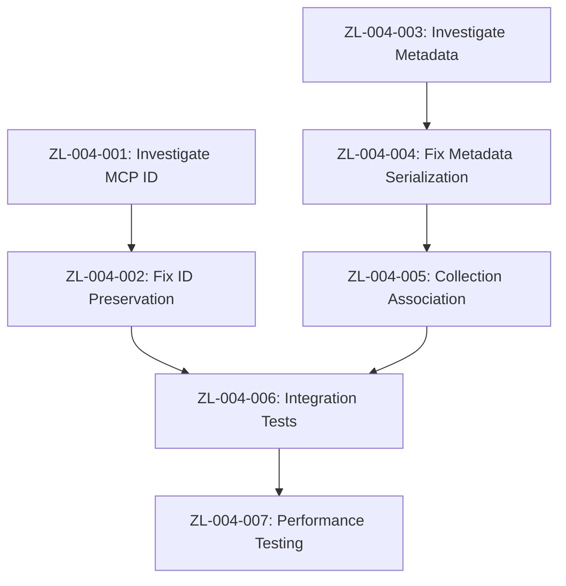

# Sprint Plan: Metadata & Collection Management Issues Resolution

**Sprint ID:** ZL-004  
**Sprint Name:** Metadata & Collection Management Issues Resolution  
**Start Date:** September 2, 2025  
**End Date:** September 16, 2025  
**Duration:** 10 working days (2 weeks)  
**Sprint Goal:** Resolve critical metadata handling and document ID preservation issues that compromise collection-based organization and external integration capabilities  
**Current Status:** PLANNED 📋 - Ready for Development  
**Related:** [Metadata Issues](../issues/metadata-issues.md), [ADR-041](../adr/041_schema-first-contract-architecture.md), [ADR-042](../adr/042_search-service-collection-filtering-resolution.md)  

---

## 🎯 Sprint Objective

Fix critical metadata and document ID preservation failures discovered during end-to-end testing. Restore collection-based organization capabilities and ensure external system integration reliability through proper ID preservation and metadata handling.

**CRITICAL VALIDATION**: End-to-end testing revealed all search results return empty metadata `{}` despite proper metadata setting during indexing. MCP interface ignores provided document IDs, breaking external system integration.

**Success Criteria:**
- [ ] All search results include complete metadata (collection, custom fields, document info)
- [ ] MCP interface preserves provided document IDs exactly as submitted
- [ ] Collection association visible in search responses
- [ ] Document metadata serialization/deserialization working correctly
- [ ] Integration tests covering metadata preservation scenarios
- [ ] External system ID tracking capabilities restored
- [ ] Collection-based filtering functionality operational

---

## 📋 Sprint Backlog

### **Epic 1: Document ID Preservation**
**Story Points:** 13  
**Priority:** Critical  

#### **ZL-004-001: Investigate MCP Document ID Handling**
**Story Points:** 5  
**Priority:** Critical  
**Status:** PLANNED 📋

**Description**: Trace document ID flow through MCP interface to identify why provided IDs are ignored.

**Acceptance Criteria**:
- [ ] MCP tools handler code fully analyzed for ID handling
- [ ] Document ID flow traced from MCP request to vector storage
- [ ] Root cause of ID generation vs preservation identified
- [ ] UUID validation and error handling patterns documented

**Technical Tasks**:
- [ ] Analyze `services/doc-indexer/src/infrastructure/mcp/` handlers
- [ ] Trace ID parameter flow through document service
- [ ] Identify where system-generated IDs override provided IDs
- [ ] Document current vs expected ID handling behavior

#### **ZL-004-002: Fix MCP Document ID Preservation**
**Story Points:** 8  
**Priority:** Critical  
**Status:** PLANNED 📋  
**Dependencies:** ZL-004-001

**Description**: Implement proper document ID preservation in MCP interface.

**Acceptance Criteria**:
- [ ] MCP `index_document` preserves provided UUID exactly
- [ ] UUID format validation with clear error messages
- [ ] Backward compatibility with auto-generated IDs maintained
- [ ] Integration tests verify ID preservation

**Technical Tasks**:
- [ ] Update MCP handler to validate and preserve provided IDs
- [ ] Implement UUID validation with proper error responses
- [ ] Ensure chunk generation respects provided document ID
- [ ] Add integration tests for ID preservation scenarios

### **Epic 2: Metadata Serialization & Preservation**
**Story Points:** 21  
**Priority:** Critical  

#### **ZL-004-003: Investigate Metadata Flow**
**Story Points:** 8  
**Priority:** Critical  
**Status:** PLANNED 📋

**Description**: Trace metadata flow from indexing to search results to identify where metadata is lost.

**Acceptance Criteria**:
- [ ] Complete metadata flow documented from indexing to search
- [ ] Metadata serialization/deserialization points identified
- [ ] Memory adapter metadata handling analyzed
- [ ] Search result conversion process mapped

**Technical Tasks**:
- [ ] Trace metadata in `document_service.rs` indexing process
- [ ] Analyze vector storage metadata preservation
- [ ] Investigate search result serialization in API handlers
- [ ] Map metadata flow through search pipeline components

#### **ZL-004-004: Fix Metadata Serialization**
**Story Points:** 8  
**Priority:** Critical  
**Status:** PLANNED 📋  
**Dependencies:** ZL-004-003

**Description**: Implement proper metadata preservation through search pipeline.

**Acceptance Criteria**:
- [ ] Search results include all indexed metadata fields
- [ ] Collection metadata properly serialized in responses
- [ ] Custom metadata fields preserved and returned
- [ ] Metadata structure consistent across API interfaces

**Technical Tasks**:
- [ ] Fix metadata serialization in search result conversion
- [ ] Ensure memory adapter preserves metadata during search
- [ ] Update API response structures to include metadata
- [ ] Add metadata validation to search response tests

#### **ZL-004-005: Collection Association Implementation**
**Story Points:** 5  
**Priority:** High  
**Status:** PLANNED 📋  
**Dependencies:** ZL-004-004

**Description**: Ensure collection association is visible and functional in search responses.

**Acceptance Criteria**:
- [ ] Search results show collection association
- [ ] Collection filtering works correctly
- [ ] Collection metadata included in search responses
- [ ] Cross-collection search maintains collection context

**Technical Tasks**:
- [ ] Implement collection metadata in search responses
- [ ] Add collection filtering validation
- [ ] Update search tests to verify collection association
- [ ] Document collection organization capabilities

### **Epic 3: Testing & Validation**
**Story Points:** 13  
**Priority:** High  

#### **ZL-004-006: Comprehensive Integration Tests**
**Story Points:** 8  
**Priority:** High  
**Status:** PLANNED 📋  
**Dependencies:** ZL-004-002, ZL-004-004

**Description**: Create comprehensive test suite for metadata and ID preservation.

**Acceptance Criteria**:
- [ ] Document ID preservation tests for MCP interface
- [ ] Metadata preservation tests for search pipeline
- [ ] Collection association tests for all interfaces
- [ ] End-to-end integration tests covering full workflows

**Technical Tasks**:
- [ ] Add `test_document_id_preservation()` integration test
- [ ] Add `test_metadata_preservation()` search test
- [ ] Add `test_collection_association()` filtering test
- [ ] Create end-to-end workflow tests

#### **ZL-004-007: Performance & Regression Testing**
**Story Points:** 5  
**Priority:** Medium  
**Status:** PLANNED 📋  
**Dependencies:** ZL-004-006

**Description**: Ensure fixes don't impact system performance or introduce regressions.

**Acceptance Criteria**:
- [ ] Search performance maintained (sub-20ms response times)
- [ ] Indexing performance not degraded
- [ ] Memory usage within acceptable limits
- [ ] No functional regressions introduced

**Technical Tasks**:
- [ ] Run performance benchmarks before/after fixes
- [ ] Execute full regression test suite
- [ ] Monitor memory usage with metadata preservation
- [ ] Validate API response times unchanged

---

## 🎯 Epic Dependencies

---

## 📊 Sprint Metrics

### **Capacity Planning**
- **Total Story Points**: 47
- **Team Capacity**: 50 story points (2 weeks)
- **Capacity Utilization**: 94%
- **Risk Buffer**: 3 story points (6%)

### **Priority Breakdown**
- **Critical**: 34 story points (72%)
- **High**: 13 story points (28%)
- **Medium**: 0 story points (0%)

### **Epic Distribution**
- **Epic 1 (ID Preservation)**: 13 points (28%)
- **Epic 2 (Metadata)**: 21 points (45%)
- **Epic 3 (Testing)**: 13 points (27%)

---

## 🚨 Risk Assessment

### **High Risk Items**
1. **Metadata Flow Complexity**: Search pipeline has multiple transformation points where metadata could be lost
2. **Backward Compatibility**: Changes to ID handling must not break existing functionality
3. **Performance Impact**: Metadata preservation might impact search performance

### **Mitigation Strategies**
1. **Incremental Implementation**: Fix one component at a time with thorough testing
2. **Comprehensive Testing**: Add tests before making changes to catch regressions
3. **Performance Monitoring**: Benchmark before/after to ensure no degradation

---

## 🎯 Definition of Done

### **Story Level**
- [ ] Code changes implemented and reviewed
- [ ] Unit tests added/updated with >90% coverage
- [ ] Integration tests pass
- [ ] Documentation updated
- [ ] Performance impact assessed

### **Epic Level**
- [ ] All acceptance criteria met
- [ ] End-to-end testing validates functionality
- [ ] No regressions introduced
- [ ] Sprint goal achieved

### **Sprint Level**
- [ ] All critical issues resolved
- [ ] Metadata preservation working correctly
- [ ] Document ID preservation implemented
- [ ] Collection association restored
- [ ] System ready for production use

---

## 🔄 Sprint Review & Retrospective

### **Success Metrics**
- [ ] Search results include complete metadata
- [ ] Document IDs preserved as provided
- [ ] Collection filtering operational
- [ ] Zero metadata-related issues in end-to-end testing
- [ ] External system integration capabilities restored

### **Key Deliverables**
- [ ] Fixed MCP document ID preservation
- [ ] Restored metadata in search results
- [ ] Functional collection association
- [ ] Comprehensive test coverage
- [ ] Performance validation

---

## 🔗 Related Documentation

- [Metadata Issues Analysis](../issues/metadata-issues.md)
- [Search Issues](../issues/search-issues.md)
- [Current Architecture](../CURRENT_ARCHITECTURE.md)
- [Schema-First Contract Architecture ADR](../adr/041_schema-first-contract-architecture.md)
- [Collection Filtering Resolution ADR](../adr/042_search-service-collection-filtering-resolution.md)
