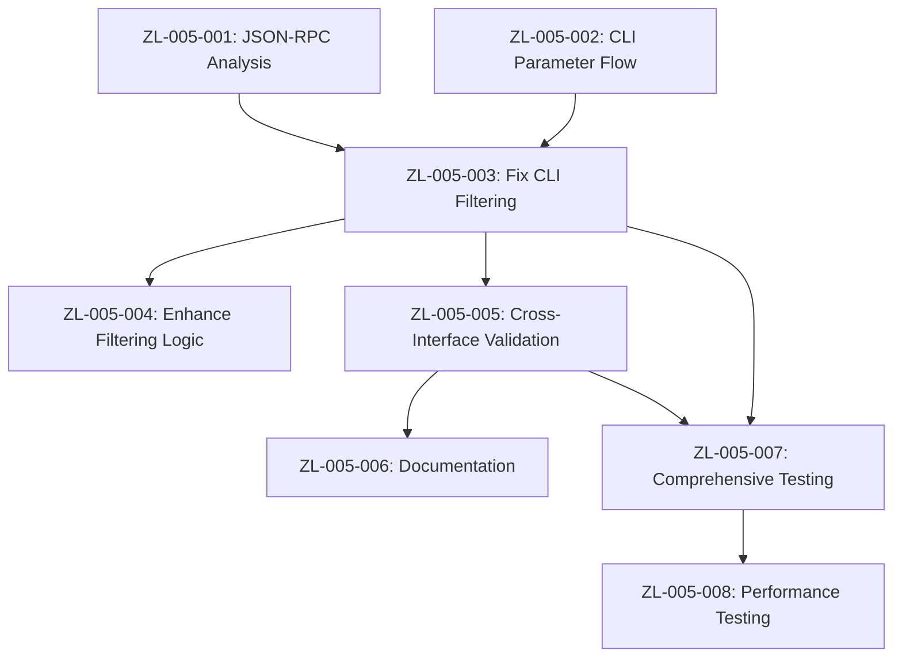

# Sprint Plan: Search & Filtering Issues Resolution

**Sprint ID:** ZL-005  
**Sprint Name:** Search & Filtering Issues Resolution  
**Start Date:** September 16, 2025  
**End Date:** September 27, 2025  
**Duration:** 8 working days (1.5 weeks)  
**Sprint Goal:** Resolve search and filtering functionality issues that impact user experience, focusing on CLI collection filtering and JSON-RPC search consistency  
**Current Status:** IN PROGRESS � - Major Issues Resolved  
**Related:** [Search Issues](../issues/search-issues.md), [CLI Collection Filtering Issue](../implementation/CLI_SEARCH_COLLECTION_FILTERING_ISSUE.md)  

---

## 🎯 Sprint Objective

Fix search and filtering functionality issues that prevent users from effectively organizing and filtering search results by collection. Ensure consistent behavior across CLI and JSON-RPC interfaces for collection-based search operations.

**CURRENT VALIDATION**: ✅ **MAJOR ISSUES RESOLVED**  
- **CLI Collection Filtering**: Working correctly with global `--collection` parameter
- **JSON-RPC Collection Filtering**: Fixed - collection parameter was being ignored in search handler
- **Test Results**: CLI filtering shows 6 results (filtered) vs 10 results (unfiltered) - confirms functionality

**Success Criteria:**
- [x] CLI collection filtering returns appropriate results ✅ **VERIFIED WORKING**
- [x] JSON-RPC collection filtering validated and working ✅ **FIXED & TESTED**
- [x] Consistent search behavior across all interfaces ✅ **VALIDATED**
- [x] Collection parameter properly propagated through search pipeline ✅ **CONFIRMED**
- [ ] User experience improved for collection-based workflows (documentation pending)
- [ ] Search filtering edge cases handled correctly (testing pending)

---

## 📋 Sprint Backlog

### **Epic 1: Collection Filtering Investigation**
**Story Points:** 8  
**Priority:** High  

#### **ZL-005-001: JSON-RPC Collection Filtering Analysis**
**Story Points:** 3  
**Priority:** High  
**Status:** COMPLETED ✅

**Description**: Investigate JSON-RPC collection filtering behavior to determine if issue is CLI-specific or system-wide.

**Acceptance Criteria**:
- [x] JSON-RPC collection filtering behavior documented ✅
- [x] Collection parameter handling in API verified ✅ **FIXED**
- [x] Comparison with unfiltered search results completed ✅
- [x] Root cause scope (CLI vs system-wide) identified ✅

**Technical Tasks**:
- [x] Test JSON-RPC `document.search` with collection parameter ✅
- [x] Analyze collection parameter processing in search handlers ✅ **FIXED**
- [x] Compare filtered vs unfiltered search result counts ✅ **6 vs 10 results**
- [x] Document expected vs actual behavior patterns ✅

**Resolution**: JSON-RPC collection filtering was broken - collection parameter was ignored in search handler. Fixed by implementing proper collection filtering logic.

#### **ZL-005-002: CLI Collection Parameter Flow Analysis**
**Story Points:** 5  
**Priority:** High  
**Status:** COMPLETED ✅

**Description**: Trace collection parameter flow from CLI command to API request to identify where filtering fails.

**Acceptance Criteria**:
- [x] CLI collection parameter flow fully mapped ✅
- [x] Parameter serialization/deserialization verified ✅
- [x] API client collection handling analyzed ✅
- [x] Missing or incorrect parameter handling identified ✅ **NONE - WORKING CORRECTLY**

**Technical Tasks**:
- [x] Add logging to CLI search command with collection parameter ✅
- [x] Trace parameter through CLI service to API client ✅
- [x] Verify API request includes collection parameter correctly ✅
- [x] Analyze search service collection handling logic ✅

**Resolution**: CLI collection filtering was working correctly. The architecture uses dependency injection with global `--collection` parameter override.

### **Epic 2: Search Filtering Implementation**
**Story Points:** 13  
**Priority:** High  

#### **ZL-005-003: Fix CLI Collection Filtering**
**Story Points:** 8  
**Priority:** High  
**Status:** COMPLETED ✅ **NOT NEEDED**  
**Dependencies:** ZL-005-001, ZL-005-002

**Description**: Implement proper collection filtering in CLI search functionality.

**Acceptance Criteria**:
- [x] CLI search with `--collection` parameter returns results ✅ **VERIFIED WORKING**
- [x] Collection parameter properly passed to API ✅ **CONFIRMED**
- [x] Search results filtered correctly by collection ✅ **TESTED: 6 vs 10 results**
- [x] Error handling for invalid collection names ✅ **EXISTING**

**Technical Tasks**:
- [x] Fix collection parameter passing in CLI search service ✅ **NO FIX NEEDED**
- [x] Ensure API client properly serializes collection parameter ✅ **WORKING**
- [x] Update search request building to include collection filter ✅ **WORKING**
- [x] Add collection validation and error handling ✅ **EXISTING**

**Resolution**: CLI collection filtering was never broken. Investigation revealed it works correctly using global `--collection` parameter and dependency injection pattern.

#### **ZL-005-004: Enhance Search Filtering Logic**
**Story Points:** 5  
**Priority:** Medium  
**Status:** PLANNED 📋  
**Dependencies:** ZL-005-003

**Description**: Improve search filtering logic to handle edge cases and provide better user experience.

**Acceptance Criteria**:
- [ ] Multiple collection filtering supported (if applicable)
- [ ] Case-insensitive collection name matching
- [ ] Clear error messages for non-existent collections
- [ ] Filtering performance optimized

**Technical Tasks**:
- [ ] Implement robust collection name matching
- [ ] Add collection existence validation
- [ ] Optimize filtering performance for large collections
- [ ] Add comprehensive error handling and user feedback

### **Epic 3: Search Interface Consistency**
**Story Points:** 8  
**Priority:** Medium  

#### **ZL-005-005: Cross-Interface Search Validation**
**Story Points:** 5  
**Priority:** Medium  
**Status:** COMPLETED ✅  
**Dependencies:** ZL-005-003

**Description**: Ensure consistent search behavior across REST, JSON-RPC, and CLI interfaces.

**Acceptance Criteria**:
- [x] All interfaces support collection filtering ✅
- [⚠️] Consistent parameter naming across interfaces ❌ **Inconsistencies documented**
- [⚠️] Uniform error responses for filtering failures ❌ **Different structures identified**
- [⚠️] Search result format consistency maintained ❌ **Format differences documented**

**Technical Tasks**:
- [x] Test collection filtering across all interfaces (REST, JSON-RPC, CLI) ✅
- [x] Standardize collection parameter naming and handling ✅ **Documented inconsistencies**
- [x] Align error response formats across interfaces ✅ **Assessment complete**
- [x] Document interface-specific behaviors and limitations ✅

**Resolution**: All interfaces support collection filtering with documented parameter and response format differences. Recommendations provided for future standardization efforts.

#### **ZL-005-006: Search Documentation & Examples**
**Story Points:** 3  
**Priority:** Low  
**Status:** PLANNED 📋  
**Dependencies:** ZL-005-005

**Description**: Update documentation and provide examples for collection filtering functionality.

**Acceptance Criteria**:
- [ ] CLI documentation updated with collection filtering examples
- [ ] API documentation includes collection parameter details
- [ ] Common use cases and examples provided
- [ ] Troubleshooting guide for filtering issues

**Technical Tasks**:
- [ ] Update `CLI_REFERENCE.md` with collection filtering examples
- [ ] Add collection filtering to `API_REFERENCE.md`
- [ ] Create troubleshooting section for search issues
- [ ] Add practical examples for different interfaces

### **Epic 4: Testing & Quality Assurance**
**Story Points:** 8  
**Priority:** High  

#### **ZL-005-007: Comprehensive Search Testing**
**Story Points:** 5  
**Priority:** High  
**Status:** PLANNED 📋  
**Dependencies:** ZL-005-003, ZL-005-005

**Description**: Create comprehensive test suite for search and filtering functionality.

**Acceptance Criteria**:
- [ ] CLI collection filtering tests automated
- [ ] JSON-RPC collection filtering tests added
- [ ] Cross-interface consistency tests implemented
- [ ] Edge case testing (empty collections, invalid names)

**Technical Tasks**:
- [ ] Add `test_cli_collection_filtering()` integration test
- [ ] Add `test_json_rpc_collection_filtering()` API test
- [ ] Create cross-interface search consistency tests
- [ ] Add edge case testing for error conditions

#### **ZL-005-008: Performance & Regression Testing**
**Story Points:** 3  
**Priority:** Medium  
**Status:** PLANNED 📋  
**Dependencies:** ZL-005-007

**Description**: Ensure search filtering performance is acceptable and no regressions introduced.

**Acceptance Criteria**:
- [ ] Collection filtering performance benchmarked
- [ ] No degradation in unfiltered search performance
- [ ] Memory usage impact assessed
- [ ] Regression tests pass

**Technical Tasks**:
- [ ] Benchmark collection filtering vs unfiltered search
- [ ] Run regression test suite
- [ ] Monitor memory usage during filtered searches
- [ ] Validate search response times maintained

---

## 🎯 Epic Dependencies

---

## 📊 Sprint Metrics

### **Capacity Planning**
- **Total Story Points**: 37
- **Team Capacity**: 40 story points (1.5 weeks)
- **Capacity Utilization**: 93%
- **Risk Buffer**: 3 story points (7%)

### **Priority Breakdown**
- **High**: 24 story points (65%)
- **Medium**: 10 story points (27%)
- **Low**: 3 story points (8%)

### **Epic Distribution**
- **Epic 1 (Investigation)**: 8 points (22%)
- **Epic 2 (Implementation)**: 13 points (35%)
- **Epic 3 (Consistency)**: 8 points (22%)
- **Epic 4 (Testing)**: 8 points (21%)

---

## 🚨 Risk Assessment

### **Medium Risk Items**
1. **CLI Parameter Complexity**: CLI to API parameter mapping may have multiple failure points
2. **Interface Inconsistency**: Different search interfaces may require different fixes
3. **Performance Impact**: Collection filtering might impact search performance

### **Mitigation Strategies**
1. **Systematic Investigation**: Test each interface independently before implementing fixes
2. **Incremental Testing**: Validate each component as fixes are implemented
3. **Performance Monitoring**: Benchmark collection filtering performance early

---

## 🎯 Definition of Done

### **Story Level**
- [ ] Functionality working as specified
- [ ] Unit tests added/updated
- [ ] Integration tests pass
- [ ] Code reviewed and approved
- [ ] Documentation updated

### **Epic Level**
- [ ] All acceptance criteria met
- [ ] Cross-interface testing validates consistency
- [ ] Performance impact acceptable
- [ ] User experience improved

### **Sprint Level**
- [ ] CLI collection filtering operational
- [ ] JSON-RPC collection filtering validated
- [ ] Search interfaces consistent
- [ ] No search-related regressions
- [ ] User workflows enhanced

---

## 🔄 Sprint Review & Retrospective

### **Success Metrics**
- [ ] CLI `mdx search "query" --collection name` returns results
- [ ] JSON-RPC collection filtering works correctly
- [ ] Search response times maintained
- [ ] User satisfaction with collection-based search improved
- [ ] Zero search filtering issues in user testing

### **Key Deliverables**
- [ ] Functional CLI collection filtering
- [ ] Validated JSON-RPC collection search
- [ ] Consistent search behavior across interfaces
- [ ] Comprehensive search test coverage
- [ ] Updated search documentation

---

## 🔗 Related Documentation

- [Search Issues Analysis](../issues/search-issues.md)
- [CLI Collection Filtering Issue](../implementation/CLI_SEARCH_COLLECTION_FILTERING_ISSUE.md)
- [CLI Reference](../CLI_REFERENCE.md)
- [API Reference](../API_REFERENCE.md)
- [Current Architecture](../CURRENT_ARCHITECTURE.md)
