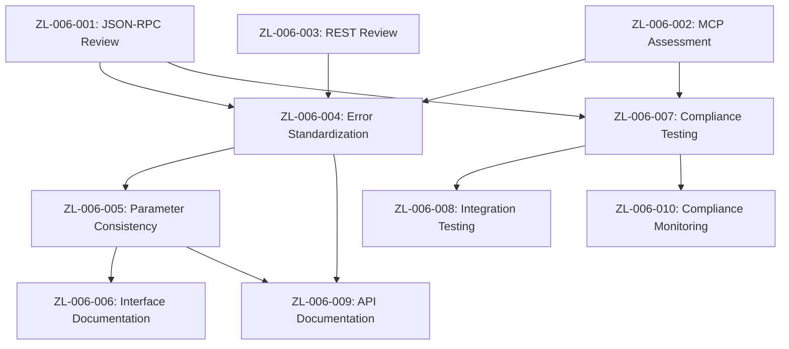

# Sprint Plan: Protocol Compliance & Standards Alignment

**Sprint ID:** ZL-006  
**Sprint Name:** Protocol Compliance & Standards Alignment  
**Start Date:** September 30, 2025  
**End Date:** October 11, 2025  
**Duration:** 10 working days (2 weeks)  
**Sprint Goal:** Enhance protocol compliance, API consistency, and standards alignment across REST, JSON-RPC, and MCP interfaces for improved integration and maintainability  
**Current Status:** PLANNED 📋 - Ready for Development  
**Related:** [Protocol Issues](../issues/protocol-issues.md), [JSON-RPC MCP Compliance](../implementation/JSON_RPC_MCP_COMPLIANCE_GAP.md), [MCP Phase 1](../implementation/JSON_RPC_MCP_PHASE_1_IMPLEMENTATION.md)  

---

## 🎯 Sprint Objective

Improve protocol compliance and API consistency across all interfaces to ensure robust integrations, standards compliance, and maintainable codebase. Address potential inconsistencies between REST, JSON-RPC, and MCP interfaces while enhancing overall API quality.

**CURRENT STATUS**: Core functionality works well across interfaces, but comprehensive compliance review needed to identify improvement opportunities and ensure future-proof architecture.

**Success Criteria:**
- [ ] Full JSON-RPC 2.0 compliance validated and documented
- [ ] MCP protocol compliance verified and enhanced
- [ ] REST API OpenAPI specification completeness achieved
- [ ] Cross-interface API consistency documented and validated
- [ ] Standards compliance testing automated
- [ ] API documentation enhanced with compliance details
- [ ] Integration testing covers all protocol aspects

---

## 📋 Sprint Backlog

### **Epic 1: Protocol Compliance Audit**
**Story Points:** 13  
**Priority:** Medium  

#### **ZL-006-001: JSON-RPC 2.0 Compliance Review**
**Story Points:** 5  
**Priority:** Medium  
**Status:** PLANNED 📋

**Description**: Comprehensive review of JSON-RPC 2.0 implementation against official specification.

**Acceptance Criteria**:
- [ ] All JSON-RPC 2.0 requirements validated against implementation
- [ ] Method discovery capabilities assessed and documented
- [ ] Error handling compliance verified
- [ ] Batch request support evaluated
- [ ] Compliance gaps identified and prioritized

**Technical Tasks**:
- [ ] Review JSON-RPC 2.0 specification requirements
- [ ] Audit current implementation against spec
- [ ] Test method discovery functionality
- [ ] Validate error code compliance
- [ ] Document compliance status and gaps

#### **ZL-006-002: MCP Protocol Compliance Assessment**
**Story Points:** 5  
**Priority:** Medium  
**Status:** PLANNED 📋

**Description**: Evaluate MCP (Model Context Protocol) compliance and identify enhancement opportunities.

**Acceptance Criteria**:
- [ ] MCP protocol version compatibility verified
- [ ] Tools interface compliance validated
- [ ] Method signatures align with MCP standards
- [ ] Response formats meet MCP requirements
- [ ] Integration patterns follow MCP best practices

**Technical Tasks**:
- [ ] Review current MCP implementation against latest spec
- [ ] Validate tools interface completeness
- [ ] Check method signature compliance
- [ ] Verify response format standards
- [ ] Document MCP compliance status

#### **ZL-006-003: REST API Standards Compliance**
**Story Points:** 3  
**Priority:** Low  
**Status:** PLANNED 📋

**Description**: Review REST API implementation for HTTP standards and OpenAPI specification completeness.

**Acceptance Criteria**:
- [ ] HTTP method usage follows REST conventions
- [ ] Status codes align with HTTP standards
- [ ] OpenAPI specification covers all endpoints
- [ ] Content-Type handling is consistent
- [ ] API versioning strategy evaluated

**Technical Tasks**:
- [ ] Audit REST endpoint HTTP compliance
- [ ] Review status code usage patterns
- [ ] Validate OpenAPI specification completeness
- [ ] Check content negotiation implementation
- [ ] Assess API versioning readiness

### **Epic 2: Interface Consistency Enhancement**
**Story Points:** 15  
**Priority:** Medium  

#### **ZL-006-004: Cross-Interface Error Handling Standardization**
**Story Points:** 5  
**Priority:** Medium  
**Status:** PLANNED 📋  
**Dependencies:** ZL-006-001, ZL-006-002, ZL-006-003

**Description**: Standardize error handling and response formats across all interfaces.

**Acceptance Criteria**:
- [ ] Consistent error response formats across interfaces
- [ ] Standard error codes mapped between protocols
- [ ] Clear error messages for all failure scenarios
- [ ] Error handling documentation updated

**Technical Tasks**:
- [ ] Define standard error response structure
- [ ] Map error codes between REST, JSON-RPC, and MCP
- [ ] Implement consistent error formatting
- [ ] Update error handling documentation

#### **ZL-006-005: API Parameter & Response Consistency**
**Story Points:** 5  
**Priority:** Medium  
**Status:** PLANNED 📋  
**Dependencies:** ZL-006-004

**Description**: Ensure consistent parameter naming and response structures across interfaces.

**Acceptance Criteria**:
- [ ] Parameter names consistent across interfaces
- [ ] Response structures align between protocols
- [ ] Data types mapped consistently
- [ ] Optional vs required parameters standardized

**Technical Tasks**:
- [ ] Audit parameter naming across interfaces
- [ ] Standardize response structure formats
- [ ] Align data type representations
- [ ] Document parameter consistency rules

#### **ZL-006-006: Interface Capability Documentation**
**Story Points:** 5  
**Priority:** Low  
**Status:** PLANNED 📋  
**Dependencies:** ZL-006-005

**Description**: Document capabilities and limitations of each interface clearly.

**Acceptance Criteria**:
- [ ] Interface-specific capabilities documented
- [ ] Limitations and constraints clearly stated
- [ ] Integration patterns and examples provided
- [ ] Best practices for each interface documented

**Technical Tasks**:
- [ ] Document REST API capabilities and constraints
- [ ] Document JSON-RPC interface features
- [ ] Document MCP tools interface scope
- [ ] Create integration pattern examples

### **Epic 3: Standards Testing & Validation**
**Story Points:** 10  
**Priority:** Medium  

#### **ZL-006-007: Protocol Compliance Testing**
**Story Points:** 5  
**Priority:** Medium  
**Status:** PLANNED 📋  
**Dependencies:** ZL-006-001, ZL-006-002

**Description**: Implement automated testing for protocol compliance validation.

**Acceptance Criteria**:
- [ ] JSON-RPC 2.0 compliance tests automated
- [ ] MCP protocol compliance validated
- [ ] REST API standards testing implemented
- [ ] Compliance regression testing enabled

**Technical Tasks**:
- [ ] Create JSON-RPC 2.0 compliance test suite
- [ ] Implement MCP protocol validation tests
- [ ] Add REST API standards compliance tests
- [ ] Integrate compliance testing into CI/CD

#### **ZL-006-008: Integration Testing Enhancement**
**Story Points:** 5  
**Priority:** Medium  
**Status:** PLANNED 📋  
**Dependencies:** ZL-006-007

**Description**: Enhance integration testing to cover cross-interface scenarios and edge cases.

**Acceptance Criteria**:
- [ ] Cross-interface integration tests implemented
- [ ] Edge case handling validated
- [ ] Protocol switching scenarios tested
- [ ] Error condition testing comprehensive

**Technical Tasks**:
- [ ] Add cross-interface integration tests
- [ ] Test protocol edge cases and error conditions
- [ ] Validate interface switching scenarios
- [ ] Enhance error handling test coverage

### **Epic 4: Documentation & Maintenance**
**Story Points:** 8  
**Priority:** Low  

#### **ZL-006-009: API Documentation Enhancement**
**Story Points:** 5  
**Priority:** Low  
**Status:** PLANNED 📋  
**Dependencies:** ZL-006-004, ZL-006-005

**Description**: Enhance API documentation with compliance details and integration guidance.

**Acceptance Criteria**:
- [ ] Protocol compliance status documented
- [ ] Integration guidance provided for each interface
- [ ] Troubleshooting guides enhanced
- [ ] API reference documentation updated

**Technical Tasks**:
- [ ] Update API_REFERENCE.md with compliance details
- [ ] Add protocol-specific integration guides
- [ ] Enhance troubleshooting documentation
- [ ] Create API usage examples

#### **ZL-006-010: Compliance Monitoring Setup**
**Story Points:** 3  
**Priority:** Low  
**Status:** PLANNED 📋  
**Dependencies:** ZL-006-007

**Description**: Set up ongoing compliance monitoring and validation processes.

**Acceptance Criteria**:
- [ ] Automated compliance checking in CI/CD
- [ ] Compliance status monitoring dashboard
- [ ] Regular compliance review process defined
- [ ] Compliance regression prevention enabled

**Technical Tasks**:
- [ ] Integrate compliance tests into build pipeline
- [ ] Set up compliance monitoring alerts
- [ ] Define compliance review schedule
- [ ] Document compliance maintenance processes

---

## 🎯 Epic Dependencies

---

## 📊 Sprint Metrics

### **Capacity Planning**
- **Total Story Points**: 46
- **Team Capacity**: 50 story points (2 weeks)
- **Capacity Utilization**: 92%
- **Risk Buffer**: 4 story points (8%)

### **Priority Breakdown**
- **Medium**: 33 story points (72%)
- **Low**: 13 story points (28%)
- **High**: 0 story points (0%)

### **Epic Distribution**
- **Epic 1 (Compliance Audit)**: 13 points (28%)
- **Epic 2 (Consistency)**: 15 points (33%)
- **Epic 3 (Testing)**: 10 points (22%)
- **Epic 4 (Documentation)**: 8 points (17%)

---

## 🚨 Risk Assessment

### **Low Risk Items**
1. **Non-Critical Improvements**: Most protocol compliance issues are enhancement opportunities, not critical failures
2. **Existing Functionality**: Current interfaces work well, changes are primarily improvements
3. **Documentation Focus**: Much of the work involves documentation and testing rather than core changes

### **Mitigation Strategies**
1. **Conservative Approach**: Focus on documentation and testing rather than major protocol changes
2. **Incremental Validation**: Validate each improvement against existing functionality
3. **Backward Compatibility**: Ensure all enhancements maintain existing API contracts

---

## 🎯 Definition of Done

### **Story Level**
- [ ] Requirements clearly understood and implemented
- [ ] Code changes (if any) reviewed and tested
- [ ] Documentation updated and accurate
- [ ] Compliance validated against standards
- [ ] Integration testing passes

### **Epic Level**
- [ ] All acceptance criteria satisfied
- [ ] Protocol compliance enhanced or validated
- [ ] Documentation comprehensive and current
- [ ] Testing coverage adequate

### **Sprint Level**
- [ ] Protocol compliance status well understood
- [ ] API consistency improved
- [ ] Documentation enhanced for integration
- [ ] Compliance monitoring established
- [ ] Standards alignment validated

---

## 🔄 Sprint Review & Retrospective

### **Success Metrics**
- [ ] JSON-RPC 2.0 compliance fully validated
- [ ] MCP protocol compliance confirmed
- [ ] Cross-interface consistency documented
- [ ] API documentation quality improved
- [ ] Compliance testing automated

### **Key Deliverables**
- [ ] Protocol compliance audit report
- [ ] Enhanced API consistency documentation
- [ ] Automated compliance testing suite
- [ ] Improved API reference documentation
- [ ] Compliance monitoring framework

---

## 🔗 Related Documentation

- [Protocol Issues](../issues/protocol-issues.md)
- [JSON-RPC MCP Compliance Gap](../implementation/JSON_RPC_MCP_COMPLIANCE_GAP.md)
- [MCP Phase 1 Implementation](../implementation/JSON_RPC_MCP_PHASE_1_IMPLEMENTATION.md)
- [Schema-First Contract Architecture ADR](../adr/041_schema-first-contract-architecture.md)
- [API Reference](../API_REFERENCE.md)
- [Current Architecture](../CURRENT_ARCHITECTURE.md)
